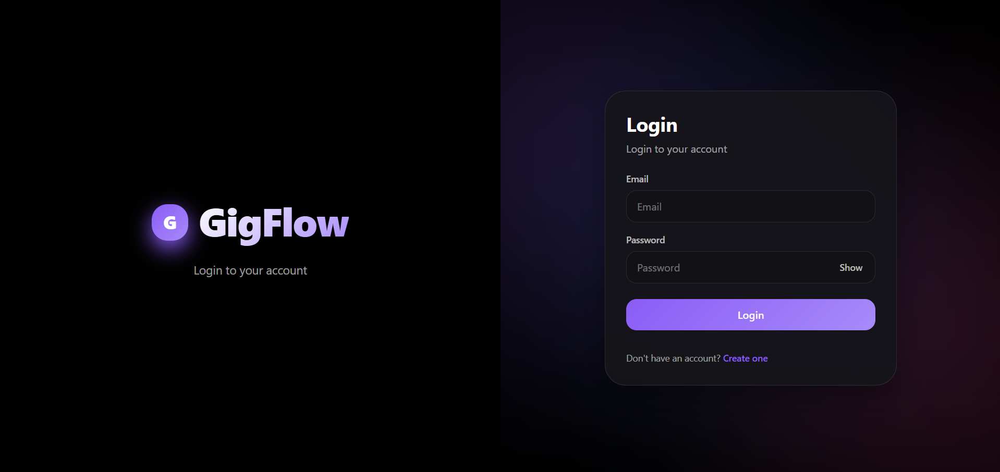
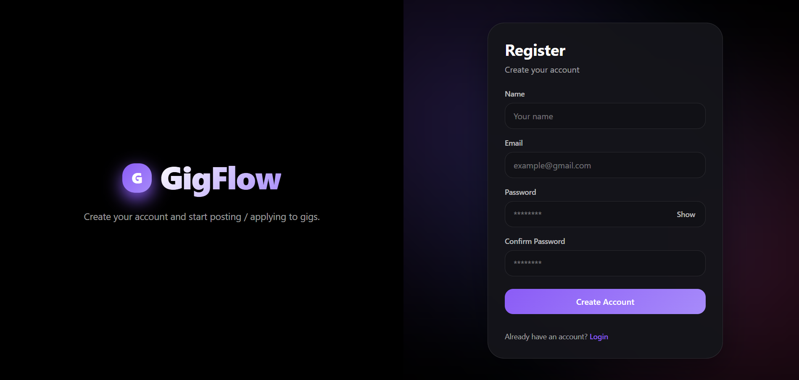
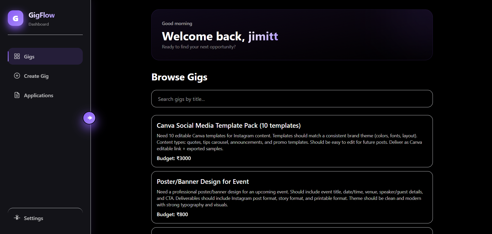
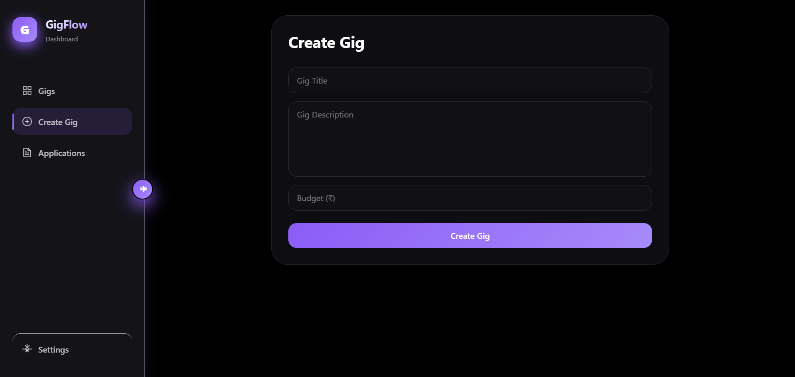
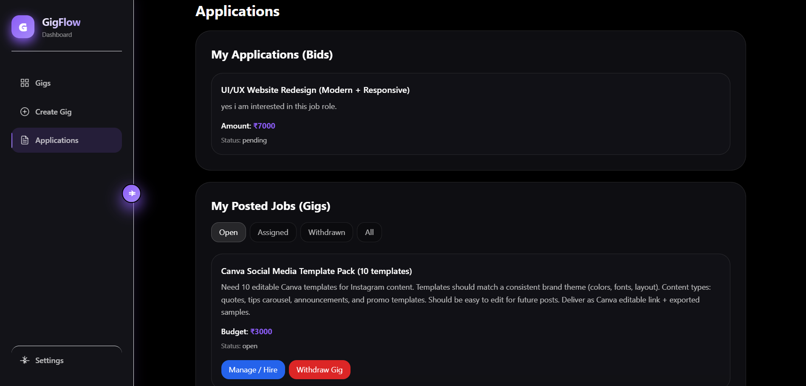

# GigFlow 🚀

A modern full-stack freelance marketplace platform built with the MERN stack, featuring real-time notifications, secure authentication, and a beautiful dark-themed UI.


## 🌐 Live Demo

- **Frontend**: [https://gigflow-beta.vercel.app](https://gigflow-beta.vercel.app)
- **Backend API**: [https://gigflow-nlo1.onrender.com](https://gigflow-nlo1.onrender.com)
- **API Documentation**: [https://gigflow-nlo1.onrender.com/api/docs](https://gigflow-nlo1.onrender.com/api/docs)

## 📸 Screenshots

<div align="center">

### Login Page


### Register Page


### Gigs Page


### Create Gig


### Gig Details & Applications



</div>

## 📋 Table of Contents

- [Features](#features)
- [Tech Stack](#tech-stack)
- [Project Structure](#project-structure)
- [Prerequisites](#prerequisites)
- [Installation](#installation)
- [Environment Variables](#environment-variables)
- [Running the Application](#running-the-application)
- [API Documentation](#api-documentation)
- [Testing](#testing)
- [Deployment](#deployment)
- [Contributing](#contributing)

## ✨ Features

### For Clients (Job Posters)
- ✅ Create and manage gig postings
- ✅ Receive and review bids from freelancers
- ✅ Hire freelancers for projects
- ✅ Withdraw or repost gigs
- ✅ Real-time notifications for new bids

### For Freelancers
- ✅ Browse available gigs
- ✅ Place bids with custom proposals
- ✅ Withdraw bids
- ✅ Track application status

### General Features
- ✅ Secure JWT-based authentication with HTTP-only cookies
- ✅ Real-time notifications via Socket.IO
- ✅ Responsive dark-themed UI
- ✅ Protected routes
- ✅ Input validation with Zod
- ✅ Rate limiting and security headers
- ✅ Transaction-safe bid hiring
- ✅ Swagger API documentation

## 🛠 Tech Stack

### Frontend
- **React** 18.x - UI framework
- **React Router** - Client-side routing
- **Axios** - HTTP client
- **Tailwind CSS** - Styling
- **Socket.IO Client** - Real-time communication
- **Vite** - Build tool

### Backend
- **Node.js** 20.19.0+ - Runtime environment
- **Express** 4.x - Web framework
- **MongoDB** - Database
- **Mongoose** 9.x - ODM
- **Socket.IO** - WebSocket server
- **JWT** - Authentication
- **Zod** - Schema validation
- **Bcrypt** - Password hashing

### DevOps & Testing
- **Jest** - Testing framework
- **Supertest** - API testing
- **MongoDB Memory Server** - In-memory DB for tests
- **Swagger** - API documentation
- **Nodemon** - Development auto-reload

## 📁 Project Structure

```
gigflow/
├── client/                 # Frontend React application
│   ├── public/
│   ├── src/
│   │   ├── components/    # Reusable components
│   │   │   ├── ProtectedRoute.jsx
│   │   │   └── SidebarLayout.jsx
│   │   ├── context/       # React context
│   │   │   └── AuthContext.jsx
│   │   ├── pages/         # Page components
│   │   │   ├── Login.jsx
│   │   │   ├── Register.jsx
│   │   │   ├── Gigs.jsx
│   │   │   ├── GigDetails.jsx
│   │   │   ├── CreateGig.jsx
│   │   │   ├── Applications.jsx
│   │   │   └── Settings.jsx
│   │   ├── utils/         # Utility functions
│   │   │   └── api.js
│   │   ├── App.jsx
│   │   ├── main.jsx
│   │   ├── socket.js
│   │   └── index.css
│   ├── package.json
│   └── vite.config.js
│
└── server/                # Backend Node.js application
    ├── __tests__/         # Test suites
    │   ├── auth.test.js
    │   ├── bid.test.js
    │   ├── gig.test.js
    │   └── setup.js
    ├── controllers/       # Route controllers
    │   ├── authController.js
    │   ├── bidController.js
    │   └── gigController.js
    ├── docs/              # API documentation
    │   └── swagger.js
    ├── middlewares/       # Express middlewares
    │   ├── auth.js
    │   └── validate.js
    ├── models/            # Mongoose models
    │   ├── User.js
    │   ├── Gig.js
    │   └── Bid.js
    ├── routes/            # API routes
    │   ├── authRoutes.js
    │   ├── bidRoutes.js
    │   └── gigRoutes.js
    ├── validators/        # Zod schemas
    │   ├── auth.validators.js
    │   ├── bid.validators.js
    │   └── gig.validators.js
    ├── index.js           # Server entry point
    ├── socket.js          # Socket.IO configuration
    ├── package.json
    └── jest.config.js
```

## 📦 Prerequisites

- **Node.js** >= 20.19.0
- **MongoDB** >= 7.0
- **npm** >= 6.0 or **yarn** >= 1.22

## 🚀 Installation

### 1. Clone the repository

```bash
git clone https://github.com/jimittpopat-bit/gigflow.git
cd gigflow
```

### 2. Install server dependencies

```bash
cd server
npm install
```

### 3. Install client dependencies

```bash
cd ../client
npm install
```

## 🔐 Environment Variables

### Server (.env)

Create a `.env` file in the `server` directory:

```env
# Server Configuration
PORT=5000
NODE_ENV=development

# MongoDB
MONGO_URI=mongodb://localhost:27017/gigflow

# JWT
JWT_SECRET=your_super_secret_jwt_key_here_change_in_production

# Client URL (for CORS)
CLIENT_URL=http://localhost:5173
```

### Client (.env)

Create a `.env` file in the `client` directory:

```env
VITE_API_BASE=http://localhost:5000
```

## 🏃 Running the Application

### Development Mode

#### Start the server (from `/server` directory):

```bash
npm run dev
```

Server will run on `http://localhost:5000`

#### Start the client (from `/client` directory):

```bash
npm run dev
```

Client will run on `http://localhost:5173`

### Production Build

#### Build the client:

```bash
cd client
npm run build
```

#### Start the server:

```bash
cd server
npm start
```

## 📚 API Documentation

Once the server is running, access the Swagger documentation at:

```
http://localhost:5000/api/docs
```

### Main API Endpoints

#### Authentication
- `POST /api/auth/register` - Register new user
- `POST /api/auth/login` - Login user
- `GET /api/auth/me` - Get current user
- `POST /api/auth/logout` - Logout user

#### Gigs
- `GET /api/gigs` - Get all open gigs
- `POST /api/gigs` - Create a new gig (auth required)
- `GET /api/gigs/:id` - Get gig details with bids
- `PATCH /api/gigs/:id` - Update gig (owner only)
- `PATCH /api/gigs/:id/withdraw` - Withdraw gig (owner only)
- `POST /api/gigs/:id/repost` - Repost withdrawn gig (owner only)
- `GET /api/gigs/my` - Get user's posted gigs (auth required)

#### Bids
- `POST /api/bids/:gigId` - Place a bid (auth required)
- `GET /api/bids/my` - Get user's bids (auth required)
- `DELETE /api/bids/:bidId` - Withdraw bid (bidder only)
- `POST /api/bids/:bidId/hire` - Hire freelancer (gig owner only)

## 🧪 Testing

The project includes comprehensive test suites using Jest and Supertest.

### Run all tests:

```bash
cd server
npm test
```

### Run tests in watch mode:

```bash
npm run test:watch
```

### Test Coverage:

- ✅ Authentication (register, login)
- ✅ Gig CRUD operations
- ✅ Bid placement and withdrawal
- ✅ Hiring workflow
- ✅ Authorization checks

## 🔒 Security Features

- **JWT Authentication** - HTTP-only cookies for secure token storage
- **Password Hashing** - Bcrypt with salt rounds of 10
- **Rate Limiting** - 30 requests per 15 minutes on auth endpoints
- **Helmet.js** - Security headers
- **XSS Protection** - XSS-clean middleware
- **CORS** - Configured for specific origins
- **Input Validation** - Zod schema validation on all inputs

## 🌐 Deployment

### Backend Deployment (Render/Railway)

1. Set environment variables on your hosting platform
2. Ensure MongoDB URI points to your cloud database (MongoDB Atlas)
3. Deploy the `server` directory

### Frontend Deployment (Vercel)

1. Update `VITE_API_BASE` to point to your deployed backend
2. Deploy the `client` directory
3. Configure environment variables in Vercel

### Environment Variables for Production

**Server:**
```env
PORT=5000
NODE_ENV=production
MONGO_URI=<your-mongodb-atlas-uri>
JWT_SECRET=<strong-secret-key>
CLIENT_URL=<your-frontend-url>
```

**Client:**
```env
VITE_API_BASE=<your-backend-url>
```

## 🎨 Key Features Implementation

### Real-time Notifications

Socket.IO is used for real-time notifications:
- Gig owners receive instant notifications when freelancers place bids
- Automatic room joining based on user ID
- Reconnection handling

### Transaction-Safe Hiring

Mongoose transactions ensure atomic operations when hiring:
1. Lock the gig status to "assigned"
2. Update hired bid to "hired" status
3. Reject all other pending bids
4. Rollback on any failure

### Repost Functionality

Withdrawn gigs can be reposted:
- Creates a new gig with same details
- Marks original gig as reposted
- Prevents duplicate reposts

## 🤝 Contributing

Contributions are welcome! Please follow these steps:

1. Fork the repository
2. Create a feature branch (`git checkout -b feature/AmazingFeature`)
3. Commit your changes (`git commit -m 'Add some AmazingFeature'`)
4. Push to the branch (`git push origin feature/AmazingFeature`)
5. Open a Pull Request

## 📝 License

This project is licensed under the ISC License.

## 👨‍💻 Author

**Jimit Popat**
- GitHub: [@jimittpopat-bit](https://github.com/jimittpopat-bit)

## 🙏 Acknowledgments

- Inspired by modern freelance platforms
- Built with best practices for MERN stack development
- Community feedback and contributions

---

**Happy Coding! 🚀**